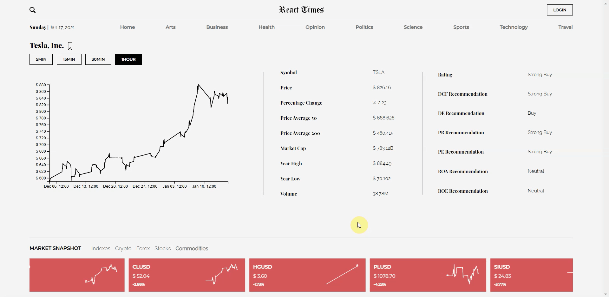

# React-Times :newspaper:

Finance / News app made with MERN stack, NYTimes API and FinancialModelingPrep
API.

## :zap: Libraries and frameworks;

React, Redux, D3.js, Styled-Components, Node, Express, MongoDB, Jest, Enzyme,
Multer, Adorable Avatars, Bcrypt, and JWT.

API can be found [here](https://github.com/urlDev/mern-react-times-api)

Design inspiration is from
[dribbble](https://dribbble.com/shots/11523226-NY-Times)

## :chart_with_upwards_trend: D3.js

I added charts to various pages:

:white_check_mark: First, with market cards that show different financial
instrument data and their chart.

:white_check_mark: Secondly, in market details page. The one in market details
page is also responsive and can show different time frames.

## :microscope: Testing

I tested the app with **Jest, Enzyme, Moxios and Redux Mock Store**. For testing
styled components, I used **React-Test-Renderer and Jest-Styled-Components**.
After 309 tests, app has 92% line coverage.

## Pages

  
   
  

## Environment Variables

**NEWS_API_KEY**: News API key is from NewYorkTimes API, more information about how to get started with their API can be found in their [documentation](https://developer.nytimes.com/get-started).

**CHART_KEY**: Chart key is from [financialModelingPrep API](https://site.financialmodelingprep.com/developer/docs/).

**API_URL**: URL for the API I created for the [project](https://github.com/urlDev/mern-react-times-api) (e.g. to help users login, save symbols). Because of the hosting issues with Heroku, I decided to host my APIs in `fly.io` and make the URL as a variable for future inconveniences.

## Scripts

- `npm run start` to start the app,
- `npm run test` or `npm t` to run tests in watch mode,
- `npm run build` to build the app,
- `npm run cover` to run test coverage,
- `npm run eject` to eject the app.

